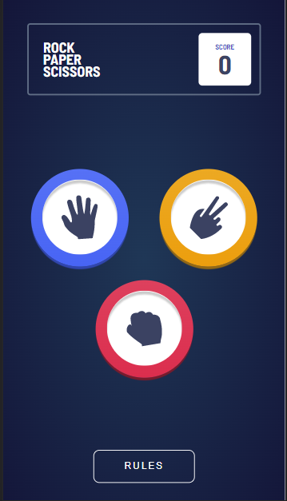
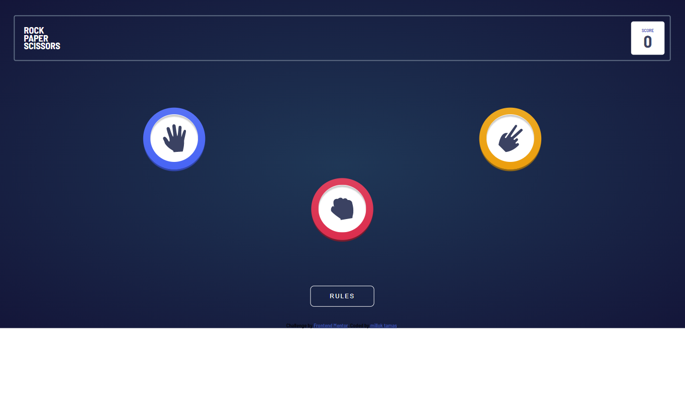

# Frontend Mentor - Rock, Paper, Scissors solution

This is a solution to the [Rock, Paper, Scissors challenge on Frontend Mentor](https://www.frontendmentor.io/challenges/rock-paper-scissors-game-pTgwgvgH). Frontend Mentor challenges help you improve your coding skills by building realistic projects. 

## Table of contents

- [Overview](#overview)
  - [The challenge](#the-challenge)
  - [Screenshot](#screenshot)
  - [Links](#links)
- [My process](#my-process)
  - [Built with](#built-with)
  - [Continued development](#continued-development)
- [Author](#author)

## Overview

Right now it is possible to play rock,paper,scissors with this app.
Nevertheless, still missing:
the desktop design,
some background parts,
the rules section,
and some finetuning of the particles,

### The challenge

Users should be able to:

- View the optimal layout for the game depending on their device's screen size
- Play Rock, Paper, Scissors against the computer
- Maintain the state of the score after refreshing the browser _(optional)_
- **Bonus**: Play Rock, Paper, Scissors, Lizard, Spock against the computer _(optional)_

### Screenshot

 

### Links

- Live Site URL: [Add live site URL here](https://your-live-site-url.com)

## My process

### Built with

- CSS custom properties
- CSS Grid
- Mobile-first workflow
- javascript

### Continued development

Still have to add the rules section,
add the triangle to the background,
finish the desktop verion design

## Author

- Website - [milloktamas](https://www.weddingrafix.com)
- Frontend Mentor - [@firkaak](https://www.frontendmentor.io/profile/firkaak)

